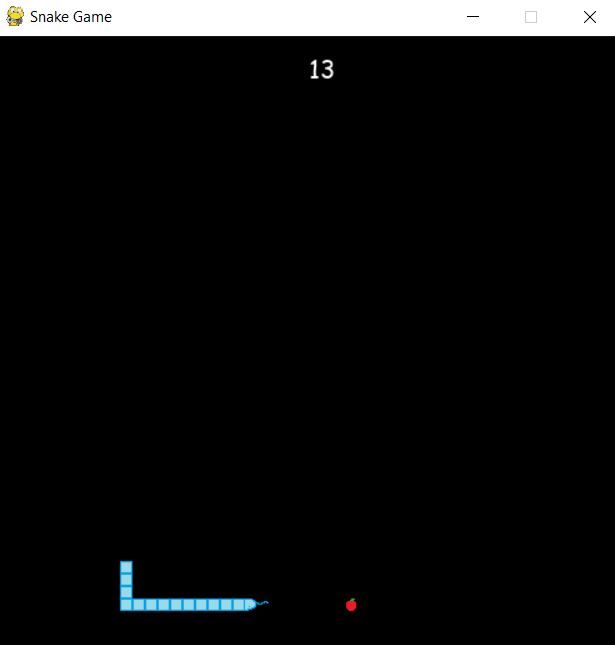
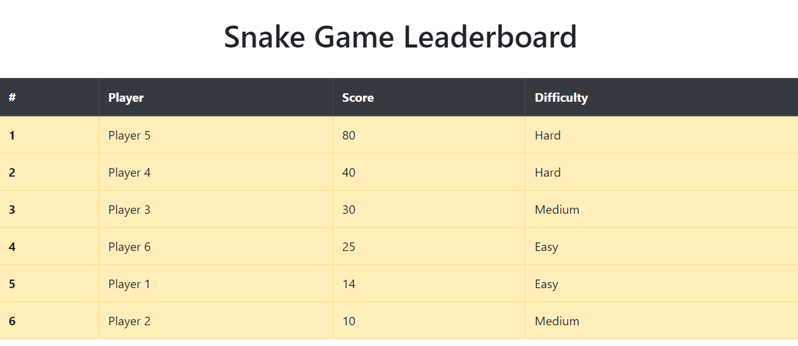

# SnakeGame

## About The Project



A retro snake game which allow player to select difficulties and to control the snake with arrow buttons.



Player can record and upload score to the leaderboard.

### Built With

Frameworks and libraries we used to build our project.

- [Python](https://www.python.org)
- [Pygame](https://www.pygame.org)
- [MySQL](https://www.mysql.com/)
- [Flask](https://flask.palletsprojects.com)
- [Bootstrap](https://getbootstrap.com)

### Installation

#### Python Dependencies

1. Clone the repo

```sh
   git clone https://github.com/QI-D/SnakeGame.git
```

2. Install dependencies

```sh
   pip install -r requirements.txt
```

#### MySQL

Follow the instructions in this [link](https://dev.mysql.com/downloads/mysql/) to install the MySQL Community Server. <br>

### Start

To play the game

```sh
python main.py
```

To see the leaderboard

```sh
python web.py
```
